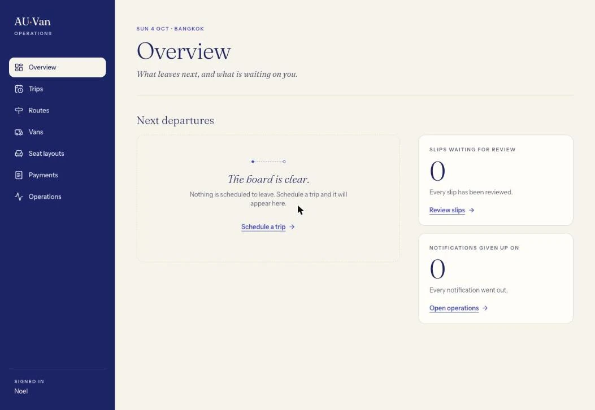
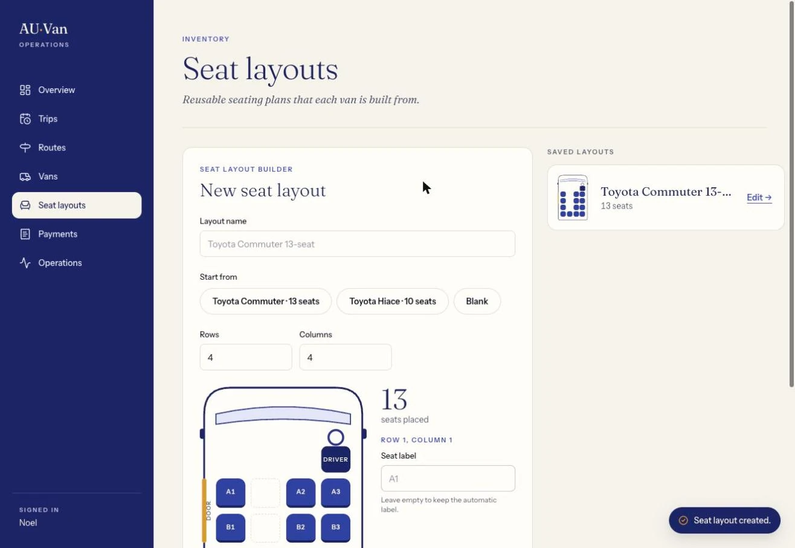
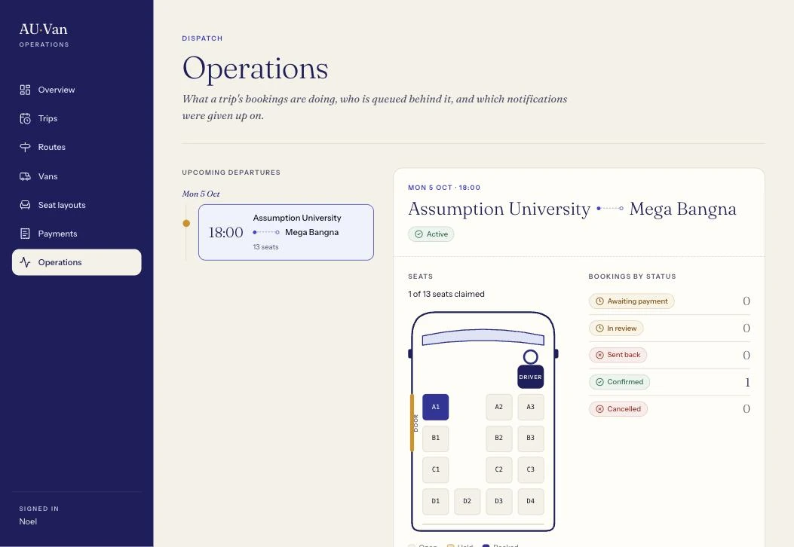
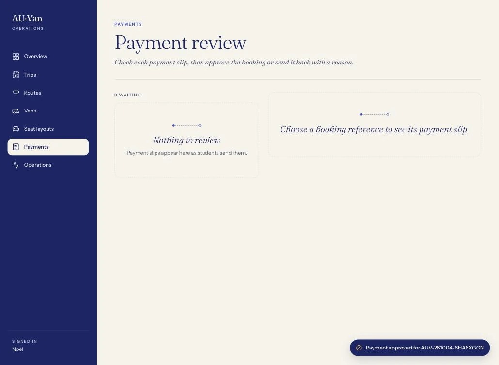
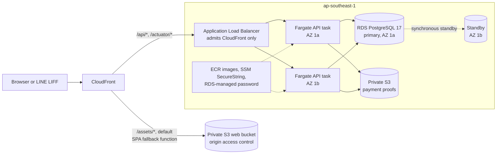
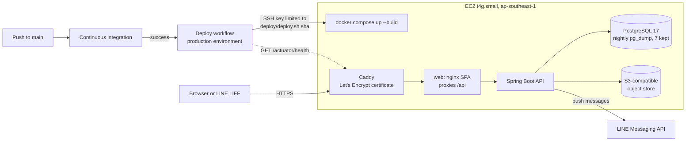

<div align="center">

# AU-Van

**Seat booking and payment review for Assumption University's van services, used from inside LINE.**

[Live demo](https://auvan.duckdns.org) · [Open in LINE](https://liff.line.me/2009602829-rdEqBUZ5) · [Architecture](docs/architecture.md) · [Decision records](docs/adr)

[](https://github.com/NoelPOS/au-van-platform/actions/workflows/ci.yml)
[](https://github.com/NoelPOS/au-van-platform/actions/workflows/deploy.yml)


</div>

---

## About

A student opens the app from LINE, holds seats on a trip, books them, and
uploads a payment slip. An administrator builds seat layouts, routes, vans and
trips, reviews each slip, and watches every departure's seat plan. Students hear
back through LINE notifications and departure reminders. When a trip is full,
students can join its waitlist, and the longest-waiting student is promoted
when a seat comes free.

This repository rebuilds a legacy Next.js application. It keeps the business
rules the legacy app had validated and replaces its runtime with a React app
and a Spring Boot modular monolith on PostgreSQL.

## Live demo

- **Web:** <https://auvan.duckdns.org>
  ([health](https://auvan.duckdns.org/actuator/health))
- **In LINE:** <https://liff.line.me/2009602829-rdEqBUZ5>

Every page needs a LINE sign-in, so a visitor without an account sees only the
sign-in page. The [screenshots](#screenshots) show the signed-in admin portal.

## Features

**Students (LINE LIFF app)**
- Sign in with LINE. The API verifies the LINE ID token with LINE and issues
  its own 15-minute JWT.
- Browse upcoming trips with live free-seat counts. The seat map refreshes
  every 10 seconds and marks each seat as available, held, held by you, or booked.
- Hold up to 4 seats for 5 minutes, with a countdown, then book with passenger
  details. Each booking gets a reference such as `AUV-261004-6HA6XGGN`.
- Upload a payment slip (JPEG, PNG or WebP, up to 5 MB) before the booking's
  payment deadline. If the slip is rejected, resubmit it after reading the
  reviewer's note.
- Join the waitlist of a full trip and see your position. When a seat frees up,
  you get a 30-minute hold on it.
- LINE Flex Message cards for 10 events:
  - booking created, cancelled or expired
  - slip submitted, approved or rejected
  - reminders 24 hours and 1 hour before departure
  - waitlist promotion offered, and the offer lapsing

**Administrators (web portal, `/admin`)**
- **Overview:** next departures, slips waiting for review, and notifications
  that failed for good (dead letters).
- **Seat layouts:** a visual grid builder for each van model.
- **Routes and vans:** fares, durations, and active or inactive status.
- **Trips:** schedule one route, van and time across several days at once. The
  database refuses to put one van on two trips at the same departure time.
- **Payments:** review queue. Slip images are streamed through the API, never
  from a public URL. Approve, or reject with a note.
- **Operations:** a departure's live seat plan, its bookings by status, its
  waitlist, and a timeline.

## Screenshots

| Admin overview | Seat layout builder |
|---|---|
|  |  |
| **Operations seat plan** | **Payment review** |
|  |  |

## How it's built

- **No overselling.** Holds and bookings share one `seat_claims` table whose
  unique key on the seat decides every race. Holds expire lazily, so
  correctness never waits on a scheduler, and the clean-up can never free a
  seat that has been sold.
  [ADR-006](docs/adr/006-seat-claims-single-table-and-lazy-hold-expiry.md)
- **Exactly-once booking.** Confirmation locks the hold's rows first. A retried
  request with the same idempotency key gets the stored response back byte for
  byte, and the same key with a different body is refused.
  [ADR-008](docs/adr/008-exactly-once-booking-creation.md)
- **Reliable LINE delivery.** Every notification is an outbox row written in
  the same transaction as the booking change:
  - A dispatcher claims rows with one conditional `UPDATE` and a 2-minute
    lease.
  - It retries with backoff from 30 s up to 1 h, at most 5 attempts.
  - It sends each row id as LINE's `X-Line-Retry-Key`, so a retry shows the
    student at most one message.
  - Departure reminders are simply outbox rows dated in the future, and they
    are withdrawn if the booking is cancelled or expires.

  [ADR-010](docs/adr/010-transactional-outbox-and-booking-deadline.md),
  [ADR-011](docs/adr/011-waitlist-promotion-by-sweep.md) for the waitlist
- **A payment deadline on every unpaid booking.** The deadline is 2 hours
  after booking, but never later than 1 hour before departure. An indexed sweep
  expires unpaid bookings, deciding from a locked row each time.
- **Payment slips stay private.** The API brokers every read and write to the
  bucket, and no URL or credential reaches a browser.
  [ADR-009](docs/adr/009-payment-proof-storage-and-review-gate.md)
- **Identity is checked server-side.** The API verifies each LINE ID token
  with LINE and issues its own short-lived JWT.
  [ADR-005](docs/adr/005-line-identity-exchange-and-short-lived-jwt.md)
- **Tests at three levels.** Features carry success- and failure-path tests. A
  Testcontainers suite on real PostgreSQL 17 re-proves the seat-hold race, the
  booking row lock and the outbox claim. Playwright drives both critical
  journeys against the full container stack without a LINE channel.
  [ADR-013](docs/adr/013-end-to-end-sign-in-without-a-line-channel.md),
  [running the suites](#run-the-end-to-end-suite)
- **CI/CD.** Every pull request runs nine checks:
  - web
  - API
  - commit messages
  - database concurrency
  - infrastructure (`terraform fmt`, `validate` and `test`)
  - deploy script
  - container
  - end-to-end
  - GitGuardian

  Web, API and commit checks are required on `main`. Deploys run in a
  `production` environment limited to `main`, through an SSH key that can only
  run `deploy/deploy.sh`.
  [ADR-014](docs/adr/014-free-always-on-host-with-ssh-deploys.md)
- **Hardened containers.** CI checks all of these, rather than leaving them as
  comments:
  - images are pinned by digest
  - both containers run as non-root users
  - the JVM runs as PID 1 and stops within 15 s
  - the bundle contains no `localhost` API URL and no test-only sign-in
- **Secrets never touch Terraform.** The database password is generated and
  stored by RDS. Application secrets are SSM SecureString parameters that ECS
  injects when the task starts.
  [ADR-012](docs/adr/012-deployed-secret-delivery.md),
  [ADR-007](docs/adr/007-terraform-for-aws-target-infrastructure.md)

## Tech stack

| Layer | Technology |
|---|---|
| API | Java 21, Spring Boot 4.1 (Web MVC, Data JPA, Security OAuth2 resource server, Validation, Actuator), Flyway, Gradle 9 |
| Data | PostgreSQL 17, S3 (AWS) / Versity S3 Gateway (local) |
| Web | React 19, TypeScript 6, Vite 8, React Router 8, TanStack Query 5, Tailwind CSS 4, LINE LIFF SDK |
| Messaging | LINE Messaging API (Flex Messages), transactional outbox in PostgreSQL |
| Testing | JUnit 5, H2 (PostgreSQL mode), Testcontainers, Vitest + Testing Library, Playwright |
| Infrastructure | Docker Compose, Caddy, nginx, Terraform (ECS Fargate, ALB, RDS, S3, CloudFront, CloudWatch, Budgets), GitHub Actions |

## Architecture

The backend is one Spring Boot application split into modules:

| Module | Responsibility |
|---|---|
| `auth` | LINE token exchange and JWTs |
| `inventory` | Routes, layouts, vans, trips |
| `booking` | Holds, bookings, payment proofs, expiry, waitlist |
| `outbox` | Recording and dispatching notifications |
| `notification` | LINE Flex cards |

The modules call each other in-process, and anything with a side effect goes
through the outbox. The React SPA serves both the student LIFF pages and the
admin portal, and reaches the API on the same origin.

The design target is a highly available AWS stack, written in Terraform under
[`infra/demo`](infra/demo). By default the module runs one or two Fargate
tasks with a single-AZ database. For one evidence session it was applied with
two tasks and a Multi-AZ database, as drawn below, and destroyed the same day;
the [evidence](#deployment-evidence) below comes from that session.



The live demo runs the same containers on one host with Docker Compose, and
every green build of `main` deploys to it.



The high-availability stack is torn down between sessions to save cost; the live
demo runs on a single EC2 host.

## Deployment evidence

All of it is from the AWS session on 2026-10-04 unless the row says otherwise.
Screenshots have the account id cropped or blacked out, and
[`cli-evidence.txt`](docs/evidence/cli-evidence.txt) has it replaced with
`<account>`.

| Claim | Evidence |
|---|---|
| The API runs as two Fargate tasks in two Availability Zones, both healthy behind the load balancer | [ECS service](docs/evidence/aws-ecs-service.webp): 2 running, 2 healthy targets. [`cli-evidence.txt`](docs/evidence/cli-evidence.txt), "ECS tasks": one task in `ap-southeast-1a`, one in `ap-southeast-1b` |
| PostgreSQL 17 is Multi-AZ and encrypted | [RDS configuration](docs/evidence/aws-rds-multi-az.webp): Multi-AZ Yes, secondary zone `ap-southeast-1b`, encryption enabled. `cli-evidence.txt`, "RDS" |
| A rolling deploy drops no requests | [`rolling-deploy-requests.log`](docs/evidence/rolling-deploy-requests.log): 362 of 362 health checks returned HTTP 200 during a forced redeploy, 08:13:25 to 08:17:20 UTC. The ECS events at the end of `cli-evidence.txt` show the old tasks draining and the deployment completing inside that window |
| The service scales on CPU | `cli-evidence.txt`, "Autoscaling": target tracking on average CPU at 60%. The session pinned the task count to 2, so [CloudWatch](docs/evidence/aws-cloudwatch-alarms.webp) shows its scale-in alarm firing with nowhere to scale to |
| CloudFront splits API and static traffic | [CloudFront behaviours](docs/evidence/aws-cloudfront-behaviours.webp): `/api/*` and `/actuator/*` to the load balancer, `/assets/*` and the default to the web bucket |
| Failure signals and spend are tracked | [CloudWatch alarms](docs/evidence/aws-cloudwatch-alarms.webp) on 5xx responses, unhealthy hosts and database free storage; a [$20 monthly budget](docs/evidence/aws-budget.webp) on the account |
| The whole flow works on AWS | An admin built a layout, route, van and trip; a student booked seat A1 and sent a slip; the admin [approved it](docs/evidence/app-payment-approved.webp) and the [seat plan](docs/evidence/app-operations-seat-plan.webp) shows A1 booked. The LINE Flex cards that followed reached the phone; they are not pictured |
| The deploy workflow ships `main` to the live EC2 host | Deploy runs [37192159826](https://github.com/NoelPOS/au-van-platform/actions/runs/37192159826) and [37193086476](https://github.com/NoelPOS/au-van-platform/actions/runs/37193086476), both started by hand on `main`, the second after the move to `auvan.duckdns.org`: in each, the SSH deploy and the health check through the public host succeeded |

## Repository layout

```text
web/        React application: admin portal and student LIFF pages
api/        Spring Boot modular monolith
infra/      Terraform for the AWS target topology and the account budget
deploy/     Live host: Caddyfile, deploy, bootstrap and backup scripts
tests/e2e/  Playwright end-to-end coverage
docs/       product, architecture, decisions, evidence, and migration inventory
```

## Local development

Prerequisites: Docker Desktop, Node.js 22+, and Java 21. On macOS, install Java with `brew install openjdk@21`, then add `export PATH="/opt/homebrew/opt/openjdk@21/bin:$PATH"` to `~/.zshrc` and restart the shell before running Gradle.

Point git at the tracked hooks once per clone, so commit messages are checked
locally before they reach CI:

```sh
scripts/setup-hooks.sh
```

Copy the safe local defaults; do not commit the resulting `.env` files. Generate a unique local password, then add it as `POSTGRES_PASSWORD` in the root `.env` file. It is intentionally not supplied by this repository.

```sh
cp .env.example .env
cp web/.env.example web/.env
openssl rand -base64 24
```

Paste the generated value after `POSTGRES_PASSWORD=` in `.env`.

For the local object store, generate an access key pair -- run `openssl rand -hex 16` twice -- and set the two values as `AWS_ACCESS_KEY_ID` and `AWS_SECRET_ACCESS_KEY` in the ignored root `.env`. The `object-store` service refuses to start without them; [Payment-proof storage](#payment-proof-storage) explains why.

For the authentication boundary, also generate a JWT signing key with `openssl rand -base64 32` and set it as `JWT_SECRET` in the ignored root `.env`. The API refuses to start without it. Add `LINE_CHANNEL_ID` only when you are ready to test a real LIFF token exchange. `VITE_LIFF_ID` belongs in the ignored `web/.env`; LINE channel secrets never belong in the frontend. `CORS_ALLOWED_ORIGINS` defaults to the Vite dev server and needs no change locally; add the LIFF tunnel's origin to it, comma-separated, only when testing through one -- never a wildcard, since these requests carry an `Authorization` header.

Start PostgreSQL and the object store. Redis is defined in `compose.yaml` but
nothing uses it yet, so you can leave it out:

```sh
docker compose up -d postgres object-store
```

If you started PostgreSQL before creating `.env`, recreate the local database so it receives the new password. This deletes local development data only:

```sh
docker compose down -v
docker compose up -d postgres object-store
```

In separate terminals, start the API and web app. Spring Boot uses the database password exported from the ignored root `.env` file, and Flyway migrates the schema on start:

```sh
cd api
set -a
source ../.env
set +a
./gradlew bootRun
```

```sh
cd web
npm ci
npm run dev
```

The frontend runs at `http://localhost:5173` and displays the result of the API health check. The API health endpoint is `http://localhost:8080/actuator/health`.

Signing in through the dev server needs a real LINE Login channel and LIFF app,
served over HTTPS (in practice a tunnel). To click through without any LINE
account, use the end-to-end stack instead: it has a sign-in control that accepts
any test subject. See [Run the end-to-end suite](#run-the-end-to-end-suite).

### Bootstrap the initial administrator

Admins are never created through the API. After you know your verified LINE user ID (the `U…` value under "Your user ID" in the LINE Developers console), add it as `ADMIN_BOOTSTRAP_LINE_SUBJECT` in the ignored root `.env`. Then, **with PostgreSQL running**, run this one-off command from `api/`:

```sh
set -a
source ../.env
set +a
./gradlew bootstrapAdmin
```

The command creates that local user if needed, or promotes the existing user to `ADMIN`. It is safe to run again. Never expose this operation as a public API endpoint. [`docs/deployment.md`](docs/deployment.md) has the container and AWS variants.

## Payment-proof storage

Payment-proof images live in a private S3 bucket (ADR-009): AWS S3 in the
deployed target, an S3-compatible store locally, one client either way. The
local store is the `object-store` service in `compose.yaml`, the Versity S3
Gateway; that file's comment says why it replaced MinIO.

Generate a credential pair yourself -- `openssl rand -hex 16`, once for each
-- and put it in the ignored root `.env` as `AWS_ACCESS_KEY_ID` and
`AWS_SECRET_ACCESS_KEY`. The object store takes that pair as its root
credential and refuses to start without it, and the API signs with the same
pair through the AWS SDK's default credentials chain. `PAYMENT_PROOF_BUCKET`
and `PAYMENT_PROOF_REGION` have working defaults; set `PAYMENT_PROOF_ENDPOINT`
to `http://localhost:9000` only when running the API on the host with
`./gradlew bootRun`, since `compose.yaml` already points the `api` container
at the `object-store` service.

The bucket is created for you: the store makes `au-van-payment-proofs` (or
whatever `PAYMENT_PROOF_BUCKET` names) every time it starts. It is private and
has no console: nothing outside the API ever reads it, and no URL to it is
ever sent to a browser.

`./gradlew test` and API checks need none of this. The tests substitute an
in-memory implementation of the storage port, so the suite still runs with no
container and no credential. Container checks and End-to-end checks do start
the object store, and each supplies its own pair: Container checks generates
one into its `.env`, and `compose.e2e.yaml` sets a fixed fixture pair.

## LINE Messaging

Notifications and departure reminders are pushed through the LINE Messaging API
(ADR-010). Set `LINE_CHANNEL_ACCESS_TOKEN` in the ignored root `.env` to the
long-lived channel access token of your **Messaging API** channel.

**This is a different channel from `LINE_CHANNEL_ID`.** That one is a LINE
**Login** channel and is used only to verify a LIFF id token; this one is a LINE
**Messaging API** channel and is used only to send. They are separate channels
with separate credentials, created separately in the LINE Developers console.

**Create the Messaging channel under the same LINE provider as the Login
channel.** A LINE user id is scoped to its provider: the `sub` this system
stores from the Login channel is a valid push target only if the Messaging
channel shares that provider. Put the Messaging channel under a different
provider and every push fails with a recipient error — a `404` naming an unknown
user — which looks exactly like a bug in this API and is not one. Nothing in the
code can detect the mismatch, so this is the thing to check first if no
notification ever arrives.

Two further facts about delivery, both of them normal rather than faults:

- A push reaches only a student who has **added your official account as a
  friend**. There is no way to know in advance, so the first attempt is also the
  discovery: LINE answers `404`, the outbox row is recorded as a dead letter, and
  it is not retried, because retrying it would fail identically forever.
- Each send carries the outbox row's id as `X-Line-Retry-Key`, which LINE
  deduplicates for twenty-four hours. That is what makes a retried send at most
  one message the student actually sees. The whole retry schedule
  (`outbox.backoff-base`, `outbox.backoff-cap`, `outbox.max-attempts`) is set to
  finish in minutes, far inside that window; changing any of the three means
  re-checking it.

Each notification is a Flex Message card: the route, departure in Bangkok time,
seats, fare and booking reference, with a status word beside its colour.
`altText`, which LINE shows in the chat list, is the plain sentence the card
summarises. A card with a next step, such as uploading a payment slip, carries
one button that opens the LIFF app; set `LINE_LIFF_URL` in the ignored root
`.env` to `https://liff.line.me/<your LIFF id>`. Left empty, every card is sent
without a button.

Neither `./gradlew test` nor CI needs the token. The tests substitute a
recording implementation of the send port, or drive the real one against a
mocked HTTP server, so the suite runs with no channel and no credential — the
same posture the payment-proof storage takes. Only an actual push to an actual
phone needs a real channel. With the token left empty, notifications are still
recorded and attempted and land as dead letters; set `LINE_MESSAGING_ENABLED` to
`false` to have them recorded and resolved without being attempted at all.

## Run the whole stack in containers

The two `Dockerfile`s build the API and the production web bundle, and
`compose.yaml` runs them next to PostgreSQL, Redis, and an S3-compatible object
store. No registry is involved: the live host builds the same images in place,
with the `compose.prod.yaml` overlay.

```sh
docker compose up -d --wait
```

It reads the same ignored root `.env`, so `POSTGRES_PASSWORD`, `JWT_SECRET`, and
the `AWS_ACCESS_KEY_ID` / `AWS_SECRET_ACCESS_KEY` pair have to be set first: the
API refuses to start without a signing key, Flyway needs the database, and the
object store refuses to start without its credential. The API answers on
`http://localhost:8080` and the production web build on `http://localhost:8081`.

That second port serves the bundle and proxies `/api` and `/actuator` to the
API, so the browser sees a single origin. This is the same contract the Vite
dev proxy gives you at `http://localhost:5173` and, per ADR-007, the one
CloudFront gives the deployed demo. `VITE_API_BASE_URL` is therefore
deliberately unset for a container build: Vite inlines build-time values into
the bundle, so an image built with a host in it would point every visitor's
browser at that host.

`VITE_LIFF_ID` is the exception, because the LINE SDK needs it before any
network call. It is a build argument, and an image built with one is specific
to that LINE channel.

```sh
docker compose build --build-arg VITE_LIFF_ID=your-liff-id web
```

Stop the stack with `docker compose down`, or `docker compose down -v` to
delete the local database volume as well.

## Testing

| Suite | Command | What it covers |
|---|---|---|
| API | `cd api && ./gradlew test` | About 280 tests on H2 in PostgreSQL mode: auth boundary, inventory, holds, bookings, expiry, payment proofs, waitlist (including concurrent contenders), outbox claim and backoff, LINE sender, Flex card limits, CORS and migrations. Needs no Docker |
| API on real PostgreSQL | `cd api && ./gradlew postgresTest` | Testcontainers concurrency suite (see below). Needs Docker |
| Web | `cd web && npm run lint && npm run test && npm run build` | oxlint, and about 200 Vitest tests over pages, hooks, services and utilities |
| End-to-end | see below | Playwright, both critical journeys on the full stack |

### Run the end-to-end suite

`tests/e2e/` is a Playwright suite covering the two critical journeys — an
administrator building a route, a van, its seats and a departure and then
reviewing a payment slip, and a student booking a seat, sending a slip and being
told what happened — against the whole stack: the real API, a real PostgreSQL,
a real S3-compatible store, and the production web bundle served by nginx.

`compose.e2e.yaml` is an overlay on `compose.yaml`, not a replacement. It adds a
stand-in for LINE's verification endpoint and points `auth.line.api-base-url` at
it, gives the object store and the API a fixture credential pair, shortens
`booking.hold-ttl` so a test can watch a hold lapse, and builds the web image
with `VITE_E2E_AUTH=true`, which adds a sign-in control that needs no LINE
channel. **None of that reaches a real image**: `ADR-013` explains why, and CI
asserts it.

It needs only `POSTGRES_PASSWORD` and `JWT_SECRET` in the ignored root `.env`
— the overlay supplies the object store's credentials — and no LINE
credential, no LIFF channel and no network egress.

```sh
docker compose -f compose.yaml -f compose.e2e.yaml up -d --wait --build
cd tests/e2e
npm ci
npm run browsers   # once per machine: downloads Chromium
npm test
```

`--build` matters. The E2E web service differs from the ordinary one only in a
build argument, so the two share an image tag; without it, compose can reuse an
image built by `docker compose build` and serve a bundle with no sign-in control
in it. The suite's global setup checks the served bundle and says so rather than
letting every spec time out.

`npm run report` opens the HTML report, and
`docker compose -f compose.yaml -f compose.e2e.yaml down -v` tears the stack
down and deletes its volumes. `npm run stack:up` and `npm run stack:down` from
`tests/e2e` are the same two compose commands.

The suite runs in one worker against one database and is not a required status
check yet; CI runs it as `End-to-end checks`.

`cd api && ./gradlew postgresTest` runs a second, smaller suite against a real
PostgreSQL 17 server that Testcontainers starts for it, pinned to the same
`postgres:17-alpine` image `compose.yaml` uses. It re-proves the handful of
concurrency guarantees that only the real engine can settle — the row lock
behind a hold's confirmation, the outbox claim's conditional `UPDATE`, and the
seat-hold race's exact conflict response — and it applies the whole migration
history to an empty database on the way. **It needs a running Docker daemon.**
`./gradlew test` deliberately does not: those classes are tagged `postgres` and
excluded from it, so the gate above stays runnable on a machine with no Docker
at all. CI runs the tagged suite as its own `Database concurrency checks` job.

## Deploy the AWS demo

[`docs/deployment.md`](docs/deployment.md) is the owner's runbook for the AWS
demo: the secrets it needs, the deployment, the smoke test, and the teardown.
The live host's own setup (bootstrap, nightly backups, SSH-restricted deploys)
lives in [`deploy/`](deploy).

## Project status

The booking, payment review, waitlist and notification flows are built, tested
and running on the live demo. The current milestone is tracked in
[project status](docs/project-status.md). Not built yet:

- a cancel button for students (the API endpoint exists)
- rescheduling
- admin tools to manage individual bookings and users
- cancelling a trip does not yet cancel and notify its bookings
- dead letters can be viewed but not retried from the portal

## Documentation

- [`docs/architecture.md`](docs/architecture.md): modules and how they fit together
- [`docs/data-model.md`](docs/data-model.md): tables, constraints and delivery semantics
- [`docs/adr`](docs/adr): every decision record
- [`docs/deployment.md`](docs/deployment.md): AWS demo runbook
- [`docs/vision-and-scope.md`](docs/vision-and-scope.md) and [`docs/current-system-inventory.md`](docs/current-system-inventory.md): product scope and the legacy app being replaced
